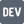

## Wisaroot Lertthaweedech

Senior Data Engineer

I build data platforms and batch and streaming pipelines on GCP with Airflow
and BigQuery. At ABACUS digital I built the cloud landing zone solo:
Terraform/Terragrunt, network, IAM, security, and the data platform on top of
it. I optimize for maintainability and repeatability: tests that fail first,
automation so no one has to remember, patterns that make the next one cheaper.

### blog

- [Make vs Just vs Task vs mise: which reuses workflows?](https://wisl.dev/blog/makefile-alternative/)
- [Version every build: semantic-release on main, zerv everywhere else](https://wisl.dev/blog/semantic-release-zerv/)
- [Developer workflows need an abstraction](https://wisl.dev/blog/developer-workflows-need-an-abstraction/)
- [How Linear Programming Lifted Oil Production by 15%](https://wisl.dev/blog/lp-oil-production-optimization/)
- [Markov Chains for Risk Model Labelling and Portfolios](https://wisl.dev/blog/markov-chain-risk-portfolio/)
- [Building a Resilient API Gateway](https://wisl.dev/blog/resilient-api-gateway/)

### open source

- **[bakefile](https://github.com/wislertt/bakefile)**: OOP Python task runner; write tasks once, reuse everywhere. [docs](https://bakefile.wisl.dev)
- **[zerv](https://github.com/wislertt/zerv)**: Rust CLI for git-based versioning; SemVer/PEP 440/CalVer, CI/CD ready. [docs](https://zerv.wisl.dev)
- **[leetcode-py](https://github.com/wislertt/leetcode-py)**: LeetCode practice environment generator, 1,400+ problems. [docs](https://leetcode-py.wisl.dev)

### elsewhere

  <a href="https://wisl.dev/"><picture><source media="(prefers-color-scheme: dark)" srcset="assets/home-dark.svg"></picture></a>
  <a href="https://wisl.dev/blog/"><picture><source media="(prefers-color-scheme: dark)" srcset="assets/blog-dark.svg"></picture></a>
  <a href="https://www.linkedin.com/in/wisl/"><picture><source media="(prefers-color-scheme: dark)" srcset="assets/linkedin-dark.svg"></picture></a>
  <a href="https://wisl.medium.com/"><picture><source media="(prefers-color-scheme: dark)" srcset="assets/medium-dark.svg"></picture></a>
  <a href="https://dev.to/wisl"><picture><source media="(prefers-color-scheme: dark)" srcset="assets/devto-dark.svg"></picture></a>

